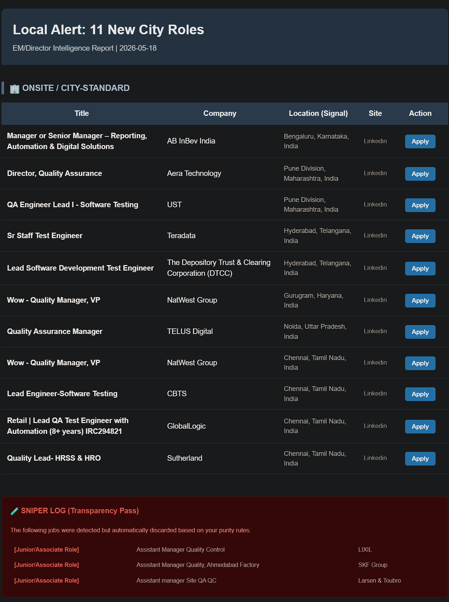
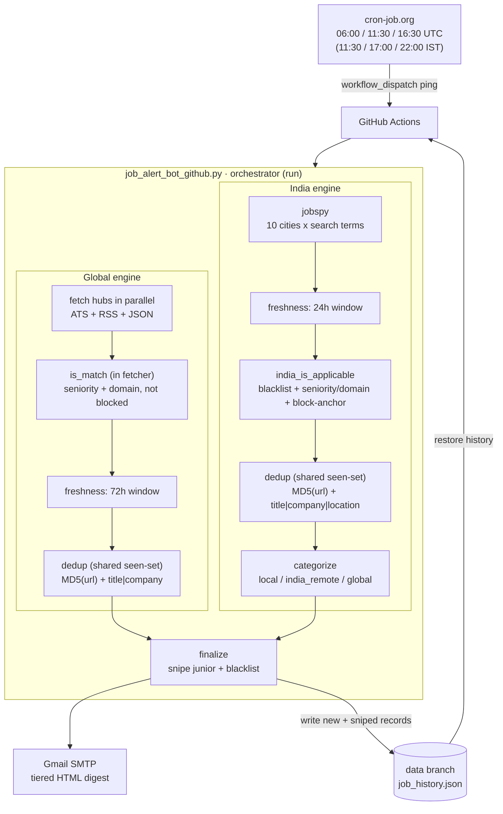

# role-radar

> A production job-discovery pipeline that scrapes 20+ sources in parallel, filters to senior QA/QE engineering-leadership roles with surgical precision, and emails a deduplicated digest three times a day, timed to the hours recruiters post in India.

[](https://www.python.org)
[](https://github.com/hemantk1539-creator/role-radar/tree/main/tests)
[](https://github.com/hemantk1539-creator/role-radar/actions)
[](https://github.com/hemantk1539-creator/role-radar/blob/main/deploy.py)
[](https://github.com/hemantk1539-creator/role-radar/blob/main/LICENSE)



*A real digest: senior QA/QE roles matched in the last 24h, bucketed by location, with one-click apply links. Manufacturing, recruiter, and junior noise is already stripped out.*

## Contents

- [Why this exists](#why-this-exists)
- [What it does](#what-it-does)
- [How it works](#how-it-works)
- [What gets kept vs dropped](#what-gets-kept-vs-dropped)
- [Engineering highlights](#engineering-highlights)
- [Security](#security)
- [Test suite](#test-suite)
- [Tech stack](#tech-stack)
- [Run it locally](#run-it-locally)
- [Deployment](#deployment)
- [Limitations](#limitations)
- [Roadmap](#roadmap)

## Why this exists

Job hunting for senior engineering-management roles has two problems that compound each other:

1. **The early-applicant window is real.** Recruiters screen the first wave of applicants first, so a role you find 48 hours late is a role you have half-lost. Manually refreshing LinkedIn and Naukri across ten cities, several times a day, is not a plan.
2. **Search is noisy.** A query for *"Quality + Manager"* on any Indian job board returns food-quality managers at PepsiCo, weld-quality engineers at L&T, and "immediate-joiner" body-shop reposts for every actual software QA leadership role.

**role-radar** solves both. It runs three times a day on a schedule tuned to India's posting peaks, pulls from 20+ sources in parallel, and applies a multi-stage filter that keeps EM, Senior EM, Director, Head, Staff, and Principal **software** QA/QE roles while silently dropping everything else. The result lands in your inbox as a clean, ranked, one-click-apply digest before most candidates have even seen the posting.

It is also a live system I run daily, so it is built like one: every change is test-gated, state is crash-safe, and the scrapers fail soft.

## What it does

- **Scrapes** LinkedIn and Indeed (via [`python-jobspy`](https://github.com/Bunsly/JobSpy)) across 10 India locations (9 metros plus remote), plus 20+ Greenhouse / Lever / Ashby / Breezy ATS boards and curated RSS/JSON remote-job feeds, all in parallel.
- **Filters** every title through a word-boundary gate: it must carry a **seniority** anchor *and* a **domain** anchor, must **not** carry a residency/junk blacklist hit, and must **not** carry a physical/manufacturing/contract block-anchor (`food quality`, `welding`, `semiconductor`, `c2c`, and so on).
- **Categorizes** each survivor into one of three buckets: `local` (city match), `india_remote` (work-from-anywhere India), or `global_remote` (timezone-agnostic / fully-remote), using city aliases, remote signals, and residency-restriction detection.
- **Deduplicates** on an MD5 of the job URL plus a `title|company|location` fingerprint, with state persisted across runs on a dedicated branch.
- **Emails** a tiered, color-coded HTML digest via Gmail SMTP. Values are HTML-escaped, so titles like *"R&D Quality Manager"* render correctly.

## How it works



*Grey = the `run()` process; everything outside it is an external system the bot integrates with - the cron scheduler, the CI runner, git-branch storage, and email.*

The pipeline is two engines that converge. The **global** engine crawls ATS/RSS/JSON hubs and qualifies titles with `is_match` *inside* each fetcher. The **India** engine runs `jobspy` across metros, then passes titles through the `india_is_applicable` gate and the `categorize` router. Both engines share one dedup state, merge into the final junior/blacklist snipe, and split into per-bucket emails; new and sniped records are written back to the `data` branch so nothing resurfaces.

## What gets kept vs dropped

The filter is title-based and deliberately tuned for precision without sacrificing the senior software-QA roles that matter. A few representative calls:

| Title | Verdict | Why |
|-------|---------|-----|
| `Engineering Manager, Quality Engineering` | ✅ kept | seniority (`manager`) + domain (`quality`), no blocks |
| `Director of Quality Engineering` | ✅ kept | a senior software-QA leadership title |
| `Test Manager, Motor Insurance` | ✅ kept | `motor` is deliberately **not** blocked, to protect BFSI/insurance software-QA roles |
| `Head of Quality, Consumer Products` | ❌ dropped | `consumer products` block-anchor (physical goods) |
| `Food Quality Control Manager` | ❌ dropped | `food quality` block-anchor |
| `QA Lead (Immediate Joiners, C2C)` | ❌ dropped | `c2c` block-anchor (body-shop contract) |
| `Senior Associate, QA Testing` | ❌ dropped | `associate` blacklist (below the EM bar) |

The matching is all word-boundary anchored, so `sales` never blocks `salesforce` and `associate` never trips on `associated`.

## Engineering highlights

The parts a code reviewer actually cares about:

### 1. Word-boundary matching everywhere (`\b`)
A naive substring filter blocks `salesforce` when you blacklist `sales`, and snipes a legitimate role titled *"...Associated..."* when you screen `associate`. Every match in the pipeline uses `\b`-anchored regex (`has_word_match`). It is enforced as a project invariant and regression-tested; `test_blacklist_substring_does_not_snipe` exists specifically so this never regresses.

### 2. Signal quality is a precision/recall decision, made explicitly
The India pipeline is *permissive by design* (it has to be, to catch fast-moving postings). Permissiveness produces relevance noise, so noise is filtered with a **phrase-based negative-domain list** (`india_block_anchors`) applied at a single extracted, unit-tested gate (`india_is_applicable`). The design choices are deliberate and documented:
- **Phrases, not bare words.** `"food quality"` is blocked; `"food"` is not, so a real QA role at a food-delivery startup survives.
- **`motor` is deliberately not a block-anchor.** It would kill *motor-insurance* software-QA roles (a real BFSI vertical). Precision was traded away here on purpose, to protect recall.
- **Company-name blocklisting was evaluated and rejected.** Conglomerates like L&T, Schneider, and AMD run real software arms, so blocking by company would drop good roles. The filter stays title-based.

### 3. State is crash-safe, and `main` stays clean
`job_history.json` is rewritten every run. Committed to `main`, it caused a merge conflict on every scheduled run between deployments. It now lives on an **orphan `data` branch**: the Action restores history from `data` before each run and writes it back after, so `main` is never touched by automation. Sniped (rejected) roles are persisted too, so junior and blacklisted titles dedup and do not resurface day after day.

### 4. The schedule is external, on purpose
GitHub's native `schedule:` cron is best-effort and routinely runs late, which is unacceptable when the whole point is to be an *early* applicant. Instead the workflow exposes `workflow_dispatch`, and an external scheduler (cron-job.org) pings it at precise UTC times chosen to hit India's morning, afternoon, and evening posting bursts.

### 5. Deployment is a quality gate, not a `git push`
Direct pushing is forbidden. `deploy.py` is the only path, and it refuses to ship code that does not pass (see [Deployment](#deployment)).

### 6. Fails soft, never silent
Every fetcher is wrapped with typed exception handling and a timeout. One dead ATS board or a malformed feed degrades that source to zero results and logs it; it never takes down the run. A monkey-patch around `jobspy`'s country parser keeps 3-part international locations from crashing the scrape.

### 7. Separated by responsibility, so it stays testable
The logic is split into focused modules: `filters.py` (pure qualification, zero I/O), `scrapers.py` (every outbound call), `emailer.py` (rendering + SMTP), `config.py` (config and history I/O), and a thin `job_alert_bot_github.py` orchestrator that just wires them into `run()`. Keeping business logic pure and at module level is a deliberate invariant: it is why the filter and categorizer can be unit-tested in isolation without mocking internals, and the test files mirror the modules one-to-one. Mocks sit only at real system boundaries (`requests`, `feedparser`, `smtplib`), never on internal functions.

### 8. Polite to the sources it depends on
Scraping is throttled on purpose: every site call waits a randomized 4-6 seconds, and the India engine runs only three parallel workers. The point is to stay under rate limits and avoid tripping the bot-detection that gets a scraper IP-blocked - these are public boards the pipeline needs to keep working against for the long term, not one-shot targets.

## Security

A live system that holds a credential and scrapes third parties, treated as one:

- **One secret, and it is never in the repo.** The Gmail app password is read from `GMAIL_APP_PASSWORD` - a GitHub Actions secret in CI, an environment variable locally. The committed `job_alert_config.yaml` carries only placeholders; sender and recipient addresses are injected at runtime too, so no personal data sits in the public repo.
- **All output is HTML-escaped.** Every scraped value is escaped before it enters the email, so a malformed or hostile job title cannot inject markup into the digest (a real bug this caught: a `<Contract>` title and an `R&D` title both used to break rendering).
- **Nothing sensitive is logged.** Failures log the source name and a truncated error string - never credentials, never the SMTP exchange.

## Test suite

**125 tests across 7 files, ~1.6s runtime.** Coverage spans the filter logic, fetcher integrations (mocked at the HTTP boundary), the categorization decision tree, the email HTML build, output-schema contracts, dedup determinism, and performance SLAs at pipeline scale. Business-logic functions live at module level specifically so they are unit-testable in isolation.

```bash
uv run python -m pytest tests/ -v
```

Tests are a **deployment gate**: `deploy.py` blocks the push if a single one fails. The full per-test reference (every class, every parametrized case, every invariant) is in **[TEST_SUITE.md](TEST_SUITE.md)**.

## Tech stack

`Python 3.10+` · `uv` · [`python-jobspy`](https://github.com/Bunsly/JobSpy) · `feedparser` · `requests` · `pyyaml` · `pytest` · GitHub Actions · Gmail SMTP

## Run it locally

```bash
# 1. Install dependencies (uv)
uv pip install -r requirements.txt

# 2. Configure: edit search terms, cities, filters, and sources.
#    All strategy lives in job_alert_config.yaml (no secrets in it).
$EDITOR job_alert_config.yaml

# 3. Provide the one secret via environment variable (never hardcoded)
export GMAIL_APP_PASSWORD="your-gmail-app-password"   # PowerShell: $env:GMAIL_APP_PASSWORD="..."

# 4. Run once
python job_alert_bot_github.py
```

Configuration is **100% data-driven**: seniority/domain anchors, block-anchors, city aliases, source URLs, ATS tokens, email tiering, and freshness windows all live in `job_alert_config.yaml`. No strategy is hardcoded in the Python, and a `deploy.py` audit enforces that.

## Deployment

`deploy.py` is the **only** authorized push path, and a commit message is required:

```bash
python deploy.py "feat: add Wellfound RSS source"
```

Every deploy runs, in order:

| Step | Gate |
|------|------|
| 1 | **Syntax / import check** on the bot module |
| 2 | **Full pytest suite.** Any failure blocks the push |
| 3 | **Sanity run.** Restores live history, executes the bot end-to-end |
| 4 | **Hardcode audit.** Fails if strategy data (long literal lists) leaked into the `.py` |
| 5 | `git stash`, `pull --rebase`, `pop`, `commit`, `push`, then server verify |

If any gate fails, nothing ships.

## Project layout

```
role-radar/
├── job_alert_bot_github.py   # entrypoint: wires the modules together, owns run()
├── config.py                 # config + dedup-history I/O (YAML, job_history.json)
├── filters.py                # pure qualification logic (is_match, finalize_list, categorize_job, …)
├── scrapers.py               # outbound fetchers (jobspy monkey-patch + ATS/RSS/JSON hubs)
├── emailer.py                # tiered HTML digest + Gmail SMTP
├── job_alert_config.yaml     # 100% of the strategy: anchors, sources, cities, tiers
├── deploy.py                 # the only authorized push path (test-gated)
├── tests/                    # 125 tests across 7 files, mirroring the modules
├── .github/workflows/        # workflow_dispatch action (external-cron) + CI on push
├── docs/sample-alert.png     # sample digest
├── TEST_SUITE.md             # full test reference
└── README.md
```

The pipeline is split by responsibility so each piece is independently testable: `filters.py` is pure (no I/O), `scrapers.py` owns every outbound call, `emailer.py` owns rendering and SMTP, and `job_alert_bot_github.py` is a thin orchestrator. The test files mirror this split (`test_filters`, `test_fetchers`, `test_history`, …).

`job_history.json` is not on `main`; it lives on the orphan `data` branch (see [State is crash-safe](#3-state-is-crash-safe-and-main-stays-clean)).

## Limitations

Honest constraints, by design or circumstance:

- **Title-based filtering catches the clear cases, not 100%.** A generically-titled industrial role (for example, plain "Manager, Quality" at a hardware firm with no give-away keyword) can still slip through. That is an accepted precision/recall trade: a stricter rule would also drop legitimate "Director of Quality" software roles, which matters more.
- **Source-dependent.** It relies on `python-jobspy` and public ATS/RSS endpoints. If a board changes its API or blocks cloud IPs (as Naukri did), that source degrades to zero until the integration is updated.
- **Single-recipient by design.** This is a personal pipeline, not a multi-tenant service.
- **No public live demo.** It emails a private inbox on a schedule; the sample screenshot above is the artifact.

## Roadmap

- **Naukri** is parked (it returns 406/reCAPTCHA on cloud IPs since early 2026). The integration code is intact and re-enables by removing one entry from `blocked_sites`; a Playwright-based probe is the next investigation.
- Several config keys (`global_hubs`, `india_sites`, deep-scrape hubs) are intentionally **parked and annotated** in the YAML for planned features. They are kept, not deleted.

## License

[MIT](LICENSE)
